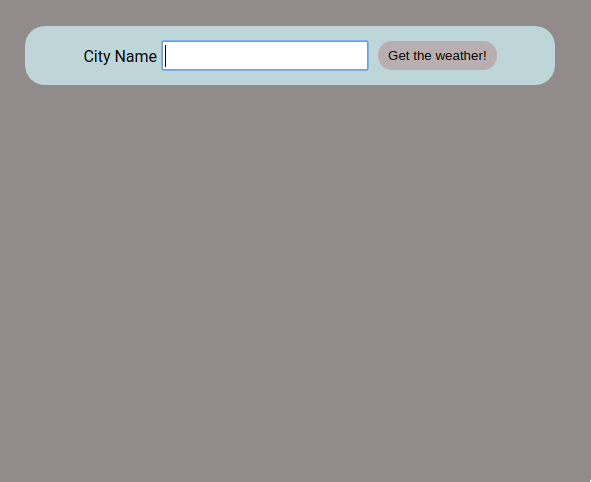
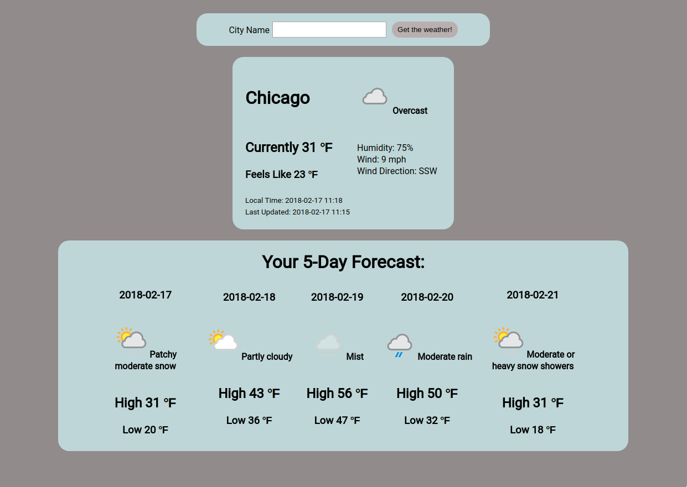

rainOrShine is a basic weather application built in React with the 'create-react-app' bootstrap and utilizing the Apixu Weather API.

To demo the project on your local machine, clone the git repository and run 'npm install' on your terminal within the project folder. This assumes you have NodeJS/npm installed globally on your machine. If this is not the case, please visit https://nodejs.org/ for more information and available downloads.

Next, you will need to acquire an Apixu API key by visiting https://www.apixu.com/. Signup is quick and free and you may use your github, facebook or google credentials if desired. Once logged in, you will be automatically shown the Dashboard view, which will display the API Key.

Within your project folder, create a 'constants.js' file under the 'src' directory. Within that file, enter the following, substituting your API Key information:

```
const ReactWeatherApiKey = 'your_API_key';

export default ReactWeatherApiKey;

```

To run the project, simply type 'npm start' in your terminal. Please note, 'yarn start' may also be used if preferred and installed. Within the search box at the top of the page, please enter the name of the city you'd like to view the weather for. Input is not case sensitive, though invalid entries, like numbers or special characters, will simply show a 'Bad Request' error within the console.

Home page view:

<p align="center">
;
</p>

Example of the results when a city is entered into the form:

<p align-"center">
;
</p>
